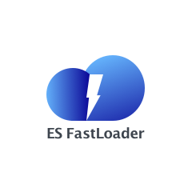

# Introduction
# 
The ES-Fastloader uses the fault tolerance and parallelism of Hadoop and builds individual ElasticSearch shards in multiple reducer nodes, then transfers shards to ElasticSearch cluster for serving. The loader will create a Hadoop job to read data from data files in HDFS, repartitions it on a per-node basis, and finally writes the generated indices to ES shards. In DiDi we have been using ES-Fastloader to create large-scale ElasticSearch indices from TB/PB level sequence files in Hive. 

# Features
* Supports batch construction of ES indexes, which can quickly process dozens of terabytes of data in 1-2 hours, and solve the low-efficiency problem when building massive ES index files.
* Support the horizontal expansion of computing power, and facilitate the expansion. By increasing the machine resources, you can further increase the index construction speed and the amount of data processed.

# Requirements
* JDK: 8 or greater
* ElasticSearch: 2.3.X or greater

# Deployment
## Configure
Edit client.properties
## Build
mvn clean package -Dmaven.test.skip=true -Ppro
## Launch --run in hadoop cluster
sh mr2es.sh project-name, e.g., sh mr2es.sh bigpassenger
## Load data
Refer to [here](src/main/java/com/didi/bigdata/mr2es/esCode)

# Developer guide
* API document [wiki](https://github.com/didi/ES-Fastloader/wiki)
* Read [core library source code](https://github.com/didi/ES-Fastloader/tree/master)
* Read [Release notes](RELEASE-NOTES.md)

# Contributing
Welcome to contribute by creating issues or sending pull requests. See [Contributing Guide](CONTRIBUTING.md) for guidelines.

# Who is using ES-Fastloader?

# License
ES-Fastloader is licensed under the Apache License 2.0. See the [LICENSE](LICENSE) file.
